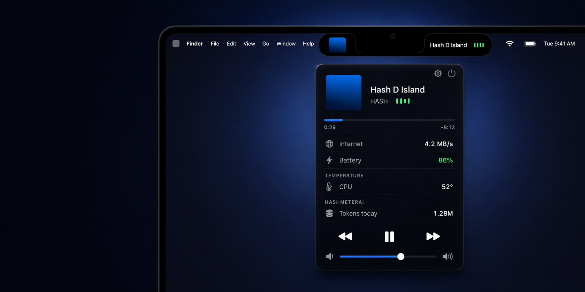

<div align="center">



# Hash D Island

### Your notch, finally alive.

**The dead space around your MacBook notch becomes a living, glanceable area** — like the iPhone's Dynamic Island, built purely for Apple Silicon. Now Playing, internet speed, battery, temperatures and AI token usage, one glance away. It reacts with smooth motion as things happen, and nothing ever leaves your Mac.

<p align="center">
  
  
  
  
  
  
  
  
</p>

<p align="center">
  <a href="#-what-it-shows"><b>What it shows</b></a> &nbsp;·&nbsp;
  <a href="#-download--install"><b>Install</b></a> &nbsp;·&nbsp;
  <a href="#-privacy-in-one-paragraph"><b>Privacy</b></a> &nbsp;·&nbsp;
  <a href="#-when-your-ai-tools-finish"><b>AI alerts</b></a> &nbsp;·&nbsp;
  <a href="#-live-activities"><b>Live activities</b></a> &nbsp;·&nbsp;
  <a href="#-develop"><b>Develop</b></a>
</p>

</div>

---

## ◦ What it shows

```
─────────────────────┐            ┌─────────────────────
 ♪ Night Drive ▍▍▎   │            │  ⌥  ⏻  ◱  100%
─────────────────────┴────────────┴─────────────────────
           ╭────────────────────────────────╮
           │ ▐▊  Night Drive                │
           │     HASH   ▍▍▎▏                │
           │ ━━━━━━━━━━━━━━━━━━━━━━         │
           │ 0:29                     -8:12 │
           │       ◀◀    ▮▮    ▶▶           │
           ├────────────────────────────────┤
           │ Internet     ↑ 4.2  ↓ 0.4 MB/s │
           │ ▁▂▅▇▅▃▂▁▂▄▆▇▅▃▂▁▂▃▅▇▅▂         │
           │ Battery     86%  1h20m to full │
           │ CPU                        18% │
           │ ▁▃▂▅▂▁▂▄▂▃▅▂▁▃▂▄▂▁▃▂▅▃▁▂▃▄▂▁▃▂ │
           │ Memory          9.4 / 16 GB    │
           │ ▄▄▅▅▄▄▅▅▅▄▄▅▅▄▄▄▅▅▄▄▅▅▄▄▅▄▄▅▅▄ │
           │ Total AI tokens          1.28M │
           │ Storage               63% full │
           │ ███████████████▓▓▓░░░░░░░░░░░░ │
           ╰────────────────────────────────╯
```

**Now Playing** — artwork, a scrolling title, and full controls for Spotify and Apple Music. Live progress bar and a system volume slider. Video in a browser can be controlled too, if you allow it in Settings — that one needs Accessibility, because pressing the media keys is the only thing a browser listens to.

> **After updating the app, re-approve Accessibility.** macOS ties that approval to the exact build it was given, and this app is not signed with a paid Apple developer certificate — so a new version arrives as a stranger. The switch in **System Settings → Privacy & Security → Accessibility** keeps *showing* Hash D Island as allowed while every media key is quietly dropped.
>
> **Switching it off and on does not fix it** — the stale entry survives either way. Select Hash D Island, remove it with the **−** button, then press **Allow** in the panel to add it back. Only browser video is affected; nothing else in the app uses this permission.

**Internet** — upload and download, with a graph of the last half-minute underneath. Or stacked, compact, or one direction only.

**Battery** — level, time remaining, and time to charge, with the adapter's wattage and whether that is a slow or fast charge. If your Mac is capped at 80%, it counts down to *that*. Low Power Mode shows in yellow, the way iPhone does it.

**Processor** — how busy the CPU is, as a number, a full-width graph of the last half-minute with a floor and ceiling to read it against, or both.

**Memory** — how much of the Mac's memory is in use, the figure Activity Monitor shows, with a matching graph. On Apple Silicon the processor and the graphics share one pool, so this is the whole machine.

**Temperatures** — the real Apple Silicon on-die sensors, as degrees, a word, or a symbol.

**AirPods** — charge left in each earbud and the case.

**AI tokens** — how much you have used today, per tool, counted from the files your tools already write. Only what they have written since the last count is read, so it stays cheap however often you ask.

**Storage** — how full the startup disk is, and how much room is left, with a bar underneath. The free figure is the one `df`, `diskutil` and Finder all agree on, so it matches every other tool on your Mac.

**Timer** — any length, counting down at the notch, with a chime at zero.

**Downloads** — a quiet notice the moment one lands.

**Live activities** — anything your scripts, Shortcuts or AI tools post.

---

## ◦ How it works

The notch stays a clean black shape at the top of your screen. **Hover it** — or swipe down on it with two fingers — and it drops into a rounded panel showing everything above. When something is live, a slim strip appears *beside* the notch without you hovering at all. Only the notch itself opens the panel, so the strip never gets in the way of the menu-bar icons beside it.

With the panel open, **swipe sideways across it to change track** — left for the next one, right for the one before. It only does this while something is actually playing, and only for a decisive sideways flick, so reading the panel can never cost you the song you were listening to.

The strip shows **one thing at a time**, and the most urgent thing wins. A track will still be playing in ten seconds; a finished job, a battery warning, or something waiting on an answer matters for a few seconds and then never again. Those take the strip and hand it straight back.

Everything opens *below* the menu bar, so it never covers your menus or status icons.

---

## ◦ How it is built

Every capability is a self-contained module. The core knows how to draw an island and how to talk to a feature through one protocol — it never knows what any feature *does*. Adding one touches a single line:

```swift
// Sources/HashDIsland/FeatureManifest.swift — the only place features meet
static func enabledFeatures() -> [NotchFeature] {
    [
        MediaFeature(), ActivitiesFeature(), DownloadsFeature(),
        TimerFeature(), TokensFeature(), NetworkFeature(),
        BatteryFeature(), AirPodsFeature(), ThermalFeature(),
        CPUFeature(), MemoryFeature(), StorageFeature(),
    ]
}
```

Three rules the code actually keeps:

**Off means off.** Switching an indicator off stops it *reading*, not just showing. A feature that is off is never started, so it opens no files, spawns no subprocess, and can trigger none of the permission prompts.

**One glance, then gone.** Something that just happened outranks something merely still true. A finished job takes the strip for a few seconds and hands it straight back to the music.

**Verified, not asserted.** 400 automated checks run before every push — the parsers, the geometry, the privacy rules, and the arithmetic behind every readout. Every commit is signed.

```
$ swift run HashDIslandChecks
  ok   a feature that is off is never started
  ok   a finished job takes the strip from the music
  ok   the keep-open zone reaches the bottom at every height
  ok   free space is never reported as more than the disk holds
  ok   a paused track in silence is left alone
  ...
All checks passed.
```

---

## ◦ Download & install

1. Get `Hash D Island.app` from the [Releases](https://github.com/Hash-7777/Hash-D-Island/releases) page, unzip it, and drag it into **Applications**. (Or build it yourself — see [Develop](#-develop).)

2. **The first time you open it,** macOS says it can't verify the developer. Click **Done**, then open **System Settings → Privacy & Security**, scroll to the bottom, and click **Open Anyway**. Confirm once and it launches; every time after that it opens normally.

3. Hash D Island has no Dock icon and adds nothing to your menu bar. **Hover the notch** to open its panel, then click the **gear** for settings.

> **Why the extra step?** It reads system-wide Now Playing and the real Apple Silicon temperature sensors, which need Apple APIs the Mac App Store doesn't allow — so it ships straight from here, and macOS asks you to confirm the first launch. It makes no network connection except to load artwork, collects nothing, and every commit is signed. Exactly what it reads and why is spelled out in [SECURITY.md](SECURITY.md).

### Requirements

- macOS 14 (Sonoma) or later
- Apple Silicon Mac (M-series)

A notch is where this belongs, and on a notched Mac the island is measured to match it exactly. On a display without one it does **not** paint a fake notch over your menu bar — it hangs just below the menu bar as a small pill of its own, and everything works the same. Either way you can nudge it by hand in **Settings → Position**, and each display remembers its own adjustment.

---

## ◦ Privacy, in one paragraph

No accounts. No analytics. No telemetry. No servers. There is exactly **one** kind of network request the app can ever make: fetching the picture for what's playing — album art from Spotify's image servers, or a video's thumbnail from YouTube's. Those are HTTPS-only, restricted to those hosts, size-capped, and refused if a redirect would leave them. The app itself writes no files; its only persistent state is its own settings.

**Off means off.** Switching an indicator off stops the work, not just the display — a feature that is off is never started, so it opens no files, runs no subprocess, and can trigger none of the permission prompts. Every claim here is checkable by reading the source, and pinned by the automated checks.

Full detail: [SECURITY.md](SECURITY.md).

---

## ◦ Your AI usage

Today's AI token use, one glance away. The strip shows a running total across your tools; open the panel for the per-tool breakdown — Claude Code, HashCortX, and HashCerebrum — counted the same way [HashMeterAi](https://github.com/Hash-7777/HashMeterAi) counts them, so the two always agree.

It reads only the local usage files those tools already write (`~/.claude/projects/**/*.jsonl`, `~/.hashcortx/usage.jsonl`, and HashCerebrum's usage log) — read-only, on your Mac, adding up numbers and nothing more.

---

## ◦ When your AI tools finish

Work in another window and let the notch tell you the moment a tool is done — a checkmark landing on the notch.

**Claude Code** — one command wires it up:

```sh
./scripts/install-claude-hooks.sh
```

Installed the app rather than the source? The same scripts travel inside the bundle:

```sh
"/Applications/Hash D Island.app/Contents/Resources/scripts/install-claude-hooks.sh"
```

From then on the island lights up when Claude **finishes a reply** — a checkmark, about three seconds, then gone — or is **waiting for your permission**, which stays until you deal with it and tells you what it is asking for. Click that one in the panel and it brings the waiting window straight to the front.

It uses Claude Code's own hook system. The hook is a small script that writes only the local activities feed, and the installer backs up your Claude settings before touching them.

> **Re-run the installer after updating the app.** The hook is copied into your home folder so you can read exactly what it does, which also means it does not follow app updates on its own. Re-running is safe at any time and tells you what it did — installed, already current, or updated from one version to the next.

> **Want a tool's logo instead of the symbol?** Drop a square PNG at `~/.hashdisland/logos/claude.png`. No logos ship with the app — those marks belong to the tools they represent, not to this one.

**HashCortX** and **HashCerebrum** are built in, nothing to install.

---

## ◦ Live activities

macOS has no system API to read another app's live activity — that only exists on iPhone. So Hash D Island reads a small local feed that any app, script, or Shortcut can write:

`~/.hashdisland/activities.json` — an array of:

```json
{ "id": "order-1", "icon": "bicycle", "title": "Food delivery",
  "subtitle": "Rider on the way", "progress": 0.6, "endsAt": "2026-07-21T21:30:00Z" }
```

`icon` is any SF Symbol name; `endsAt` (ISO 8601) drives a live countdown; activities merge by `id` and expired ones disappear on their own.

There are two kinds. A **countdown** is something still happening, and shows its time left. A **notice** is something that already happened — set `dismissAfter` (seconds) instead, and it draws no timer and leaves on its own. A number ticking down next to the word "finished" only ever asked you to watch something that was already over.

Two optional extras: `image` is a path to a logo shown instead of the symbol, and `app` is a path to an installed `.app` bundle — set it and the row in the panel becomes clickable, bringing that app forward. The app has to live where macOS keeps applications (`/Applications`, `/System/Applications`, or `~/Applications`); anything else is ignored, so a feed can never point a click at a bundle dropped somewhere out of the way.

```sh
./scripts/post-activity.sh "Food delivery" "Rider on the way" bicycle 12
./scripts/post-activity.sh --notice 3 "Build finished" "release" hammer
./scripts/post-activity.sh --clear
```

---

## ◦ Now Playing

Whatever is playing shows in the notch — artwork, a scrolling title for long names, and audio bars that dance while sound is playing. Spotify and Apple Music show their album art; a YouTube video in your browser shows its thumbnail. Open the panel for iPhone-style controls that work for all of it: play/pause, skip, a live progress bar, and a system volume slider.

Apple locked the direct MediaRemote call behind an entitlement on macOS 15.4+/26, so Hash D Island reads it through a tiny `osascript` subprocess using `MRNowPlayingRequest` — which still works on those versions, and runs out of process so it can never crash the app.

---

## ◦ Customize it

Hover the notch, then click the **gear** beside it (quit sits on the other side of the notch). There you can turn each indicator on or off and **drag to reorder** them, choose how each one looks, pick an accent colour and the panel's fill and roundness, set how eager the motion is, choose how long a finished alert stays, turn on **Battery saver**, set **how often the AI token count runs** (every minute through to only when you ask), nudge the island's position and size per display, turn on **Open at Login**, and quit.

There is no menu-bar item and no Dock icon by design — the notch is the whole interface.

---

## ◦ Remove it

Nothing about this app is hidden, and taking it off your Mac is quick:

1. Settings → turn **Open at Login** off, then **Quit Hash D Island**.
2. Drag the app from Applications to the Trash.
3. Delete `~/.hashdisland`.
4. If you ran the installer, remove the two entries mentioning `claude-code-hook.sh` from `~/.claude/settings.json`. (A backup sits next to it.)
5. `defaults delete com.hashdisland.app`

That's everything it ever wrote. No launch agents, no caches, no receipts.

---

## ◦ Develop

A Swift Package — it builds and runs with the Command Line Tools alone, no full Xcode required.

```sh
swift build                 # compile everything
swift run HashDIsland       # launch the notch overlay
swift run HashDIslandChecks # run the core checks
./scripts/build_app.sh      # assemble "build/Hash D Island.app"
```

"Open at Login" only works from the built `.app` (macOS manages login items by bundle), so run `build_app.sh` to use it.

Every capability is a self-contained module: adding or removing one touches a single manifest line and never the core. See [docs/ARCHITECTURE.md](docs/ARCHITECTURE.md).

---

<div align="center">

Release notes in [CHANGELOG.md](CHANGELOG.md) · Security and privacy in [SECURITY.md](SECURITY.md)

**[Apache 2.0](LICENSE)** © 2026 Seif Hashish

</div>
