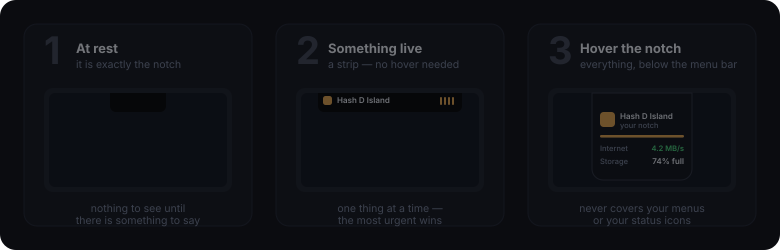
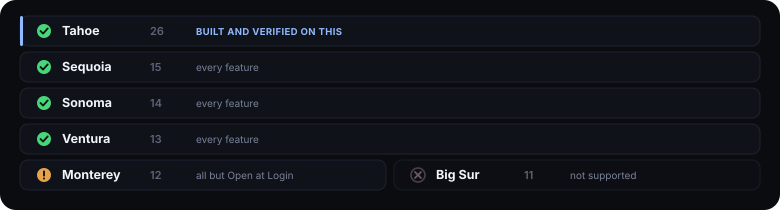
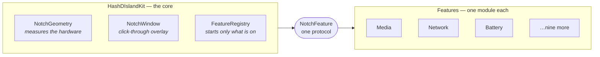

<div align="center">


# Hash D Island

### Your notch, finally alive.

**Apple gave you a notch. This gives you a reason to look at it.**

What's playing, how fast your internet is, what your battery is doing, how hot the chip is running, what you have spent on AI today — all of it a glance away, and **none of it leaves your Mac**. No account. No telemetry. Not a single network request.

<p align="center">
  
  
  
  
  
  
</p>

<a href="#-install"><b>Install</b></a> &nbsp;·&nbsp;
<a href="#-what-it-shows"><b>What it shows</b></a> &nbsp;·&nbsp;
<a href="#-why-this-one"><b>Why this one</b></a> &nbsp;·&nbsp;
<a href="#-privacy"><b>Privacy</b></a> &nbsp;·&nbsp;
<a href="#-for-developers"><b>Developers</b></a>

</div>

---

## ◦ How it works

<div align="center">

</div>

Three states, and it is only ever in one of them. **At rest it is invisible** — a black shape exactly the size of your notch. **When something is happening** a slim strip appears beside it without you doing anything. **Hover the notch** and the whole panel drops down, below the menu bar, so it never covers your menus.

Swipe **down** on the notch to open it. Swipe **sideways** across the open panel to change track.

---

## ◦ What it shows

**Now playing** — anything that plays. Spotify, Apple Music, TV, Podcasts, Anghami, VLC, a browser tab. Real artwork for all of it, a title that scrolls, a progress bar you can drag, and a volume slider.

**Internet** — live upload and download, with the last half-minute graphed underneath.

**Battery** — level, time left, time to full, adapter wattage, Low Power Mode. Capped at 80% for its health? It counts down to *that*, not to a full charge it will never reach.

**Processor and memory** — how hard your Mac is working, in the same figures Activity Monitor shows.

**Temperatures** — the real Apple Silicon on-die sensors, not an estimate.

**AI tokens** — what you have spent today, across Claude Code, HashCortX and HashCerebrum.

**Storage** — how full the disk is, using the figure `df` and Disk Utility agree on.

**Timer**, **downloads**, **AirPods charge**, and **live activities** anything can post to.

Switch any of them off, drag to reorder, restyle each one. The panel is yours.

---

## ◦ Why this one

**Every app gets artwork — not a list of supported ones.** There is no hand-written support per player here, so nothing falls off the end of a list. macOS itself is asked what is playing, which means a niche music app, a podcast player, or something released next year arrives with real cover art and working controls on day one, with no update from me.

**Zero network requests.** Not "encrypted", not "anonymised" — none. The artwork comes from the system, so there is nothing to fetch and nothing that could ever leak. You can verify that claim with Little Snitch in about ten seconds.

**Off means off.** Switching an indicator off stops it *reading*, not just showing. A feature that is off opens no files, runs no subprocess, and can trigger none of the permission prompts.

**One glance, then gone.** Something that just happened outranks something merely still true. A finished job takes the strip for a few seconds and hands it back to the music.

**Verified, not asserted.** 440 automated checks run before every push — the parsers, the geometry, the privacy rules, and the arithmetic behind every readout. Every commit is signed.

```
$ swift run HashDIslandChecks
  ok   a feature that is off is never started
  ok   the optimistic "could be made free" figure is not used as free space
  ok   a cover that arrives after a skip is dropped
  ok   an app outside the standard folders is refused
  ok   the checks leave no preference domains behind
  ...
All checks passed.
```

---

## ◦ Install

1. Download `Hash D Island.app` from [Releases](https://github.com/Hash-7777/Hash-D-Island/releases), unzip, drag it into **Applications**.
2. First launch, macOS says it cannot verify the developer. Click **Done**, then **System Settings → Privacy & Security → Open Anyway**. Once only.
3. **Hover the notch.** No Dock icon, no menu-bar item — the notch is the whole interface. The gear beside it opens settings.

### Which macOS

<div align="center">

</div>

On **Monterey**, everything works except Open at Login, which needs macOS 13 — and the app says so plainly rather than failing quietly. **Big Sur** is out: some of the drawing this relies on does not exist there.

Any **Apple Silicon** Mac (M1 and later). Older releases get every feature, with a little longer per animation and one less heavy effect, so the motion stays smooth on the machines with the least to spare.

> **Why the extra step?** It reads system-wide Now Playing and the real temperature sensors, which need Apple interfaces the App Store does not allow — so it ships straight from here. Everything it reads is spelled out in **[SECURITY.md](SECURITY.md)**.

**No notch?** It still works. The island is drawn against the top bezel and made exactly as tall as your menu bar, so it fills the one part macOS never uses — the middle, between the app menus on the left and the status icons on the right. Nudge its position and size per display in Settings.

---

## ◦ Privacy

No accounts. No analytics. No telemetry. No servers. **No network requests at all.**

The app writes no files; its only stored state is its own settings. Removing it takes four steps and leaves nothing behind.

Every permission it can ask for, every value it reads, the two private Apple interfaces it uses, and the full uninstall: **[SECURITY.md](SECURITY.md)**. Every claim there is checkable by reading the source and pinned by the checks.

---

## ◦ When your AI tools finish

Let the notch tell you the moment a tool is done — a checkmark landing on the notch, then gone.

```sh
./scripts/install-claude-hooks.sh
```

The island lights up when **Claude Code** finishes a reply, or is **waiting for your permission** — click that one and the waiting window comes to the front. **HashCortX** and **HashCerebrum** are built in.

Setup, and the local feed any script or Shortcut can write to: **[docs/ACTIVITIES.md](docs/ACTIVITIES.md)**.

---

## ◦ For developers

A Swift package. Builds and runs with the Command Line Tools alone — no full Xcode.

```sh
swift build                 # compile
swift run HashDIsland       # launch the overlay
swift run HashDIslandChecks # run the checks
./scripts/build_app.sh      # assemble the .app
```

Every capability is a self-contained module. The core knows how to draw an island and how to talk to a feature through one protocol — it never knows what any feature *does*, so adding or removing one touches a single line:



```swift
// Sources/HashDIsland/FeatureManifest.swift — the only place features meet
static func enabledFeatures() -> [NotchFeature] {
    [
        MediaFeature(), ActivitiesFeature(), DownloadsFeature(),
        TimerFeature(), TokensFeature(), NetworkFeature(),
        BatteryFeature(), AirPodsFeature(), ThermalFeature(),
        CPUFeature(), MemoryFeature(), StorageFeature(),
    ]
}
```

Architecture in full: **[docs/ARCHITECTURE.md](docs/ARCHITECTURE.md)**.

---

<div align="center">

**[Apache 2.0](LICENSE)** © 2026 Seif Hashish

[Release notes](CHANGELOG.md) · [Security & privacy](SECURITY.md) · [Architecture](docs/ARCHITECTURE.md)

</div>
