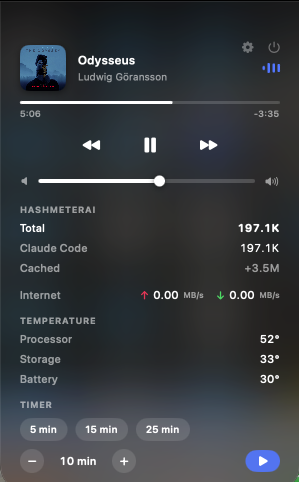
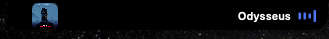

# Hash D Island

Your notch, finally alive.

Hash D Island turns the dead space around the notch into a living, glanceable area —
like the iPhone's Dynamic Island, but built purely for Apple Silicon. It reacts
with smooth motion as things happen and keeps the numbers you care about one
glance away.

## See it in action

<p align="center">
  
</p>

<p align="center">
  
</p>

## What it shows

- **Now Playing** — artwork, a scrolling title, and full controls for whatever
  is playing, including video in your browser
- **Live internet usage** — upload and download speed
- **Battery** — level, charging state, and time remaining, plus a heads-up the
  moment you plug in or run low
- **AirPods** — the charge left in each earbud and the case
- **Temperatures** — processor, graphics, storage, and battery sensors
- **AI token usage** — how much you have used today, per tool
- **A timer** — start it from the panel, watch it count down at the notch
- **Finished downloads** — a quiet notice when one lands
- **Live activities** — anything your own scripts, Shortcuts, or AI tools post
- **Motion** — expands, pulses, and animates as events happen

## Built for Apple Silicon

Native Swift (SwiftUI + AppKit), tuned for 120Hz ProMotion so every animation
stays buttery smooth with a light footprint. Runs entirely on your Mac — no
accounts, no cloud, no data collection.

## Requirements

- macOS 14 (Sonoma) or later
- Apple Silicon Mac (M-series)

A notch is where this belongs, and on a notched Mac the island is measured to
match it exactly. On a display without one — an external monitor, an iMac, an
older Air — it does **not** paint a fake notch over your menu bar: it hangs
just below the menu bar instead, as a small pill of its own, and everything
works the same. Either way you can nudge it by hand in **Settings → Position**,
and each display remembers its own adjustment.

## Download & install

1. Get `Hash D Island.app` from the
   [Releases](https://github.com/Hash-7777/Hash-D-Island/releases) page, unzip
   it, and drag **Hash D Island** into your **Applications** folder. (Or build it
   yourself — see [Develop](#develop) below.)
2. **The first time you open it,** macOS says it can't verify the developer.
   Click **Done**, then open **System Settings → Privacy & Security**, scroll to
   the bottom, and click **Open Anyway** next to Hash D Island. Confirm once and it
   launches; every time after that it opens normally. (On older macOS you can
   instead right-click the app and choose **Open**.)
3. Hash D Island has no Dock icon and adds nothing to your menu bar — it lives
   entirely around the notch. **Hover the notch** to open its panel, then click
   the **gear** for settings: choose what shows, turn on **Open at Login**, and
   quit the app. (Settings also opens by itself the very first time, so you
   know where it is.)

> **Why the extra step to open it?** Hash D Island reads system-wide Now Playing and
> the real Apple Silicon temperature sensors, which need Apple APIs the Mac App
> Store doesn't allow — so it ships straight from here instead of the store, and
> macOS asks you to confirm the first launch. It makes no network connection
> except to load album and video artwork, collects nothing, and every commit is
> signed. Exactly what it reads and why is spelled out in [SECURITY.md](SECURITY.md).

## How it works

The notch stays a clean black shape at the top of your screen. **Hover it** (or
swipe down on it with two fingers) and it smoothly drops into a rounded panel —
like the iPhone's Dynamic Island — showing your internet speed, battery,
temperatures, AI token usage, and more. When something is live — music playing,
a timer running, an activity in progress — a slim strip appears *beside* the
notch without you hovering at all. Because everything opens below the menu bar,
it never overlaps your menus or status icons.

## Live activities

Since macOS has no system API to read another app's live activity (that only
exists on iPhone), Hash D Island instead reads a small local feed that any app,
script, or Apple Shortcut can write:

`~/.hashdisland/activities.json` — an array of:

```json
{ "id": "order-1", "icon": "bicycle", "title": "Food delivery",
  "subtitle": "Rider on the way", "progress": 0.6, "endsAt": "2026-07-21T21:30:00Z" }
```

`icon` is any SF Symbol name; `endsAt` (ISO 8601) drives a live countdown;
activities merge by `id` and expired ones disappear on their own.

There are two kinds. A **countdown** is something still happening, and shows
its time left. A **notice** is something that already happened — set
`dismissAfter` (seconds) instead, and it draws no timer and leaves on its own.
A number ticking down next to the word "finished" only ever asked you to watch
something that was already over.

```sh
./scripts/post-activity.sh "Food delivery" "Rider on the way" bicycle 12
./scripts/post-activity.sh --notice 3 "Build finished" "release" hammer
./scripts/post-activity.sh --clear
```

## Your AI usage

Hash D Island keeps today's AI token use one glance away. The strip shows a running
total across your tools; open the panel for the per-tool breakdown — Claude
Code, HashCortX, and HashCerebrum — under a **HashMeterAi** heading, counted the
same way [HashMeterAi](https://github.com/Hash-7777/HashMeterAi) counts them so
the two always agree. It reads only the local usage files those tools already
write (`~/.claude/projects/**/*.jsonl`, `~/.hashcortx/usage.jsonl`, and
HashCerebrum's usage log) — read-only, on your Mac, adding up numbers and
nothing more.

## When your AI tools finish

Work in another window and let the notch tell you the moment an AI tool is done
— a checkmark landing on the notch, like the iPhone Dynamic Island.

- **Claude Code** — one command wires it up:

  ```sh
  ./scripts/install-claude-hooks.sh
  ```

  If you installed the app rather than building it, the same scripts travel
  inside the bundle:

  ```sh
  "/Applications/Hash D Island.app/Contents/Resources/scripts/install-claude-hooks.sh"
  ```

  From then on the island lights up the moment Claude **finishes a reply** — a
  checkmark and the project name, for about three seconds, then gone — or is
  **waiting for your permission**, which stays put until you deal with it. It
  uses Claude Code's own hook system; the hook is a small script that writes
  only the local activities feed, and the installer backs up your Claude
  settings before touching them (and replaces its own older entry if you run it
  again).

  **Re-run it after updating Hash D Island.** The hook is copied into your home
  folder so you can read exactly what it does, which also means it does not
  follow app updates on its own. Running the installer again is safe at any
  time, and it tells you what it did — installed, already current, or updated
  from one version to the next.

- **HashCortX** and **HashCerebrum** — built in, nothing to install. HashCortX
  flashes "HashCortX finished" when a run completes; HashCerebrum lights up when
  a manuscript or peer review is ready.

Under the hood they all use the same local feed
(`~/.hashdisland/activities.json`, see [Live activities](#live-activities)), so
any app, script, or Shortcut can light up your notch the same way.

## Now Playing

Whatever is playing (music, video) shows in the notch — artwork, a scrolling
title for long names, and audio bars that dance while sound is playing.
Spotify and Apple Music show their album art; a YouTube video playing in your
browser shows its video thumbnail. Open the panel and you get iPhone-style
media controls that work for all of it: play/pause, skip, a live progress
bar, and a system volume slider.

Apple locked the direct MediaRemote call behind an entitlement on macOS
15.4+/26, so Hash D Island reads it through a tiny `osascript` (JavaScript for
Automation) subprocess using `MRNowPlayingRequest` — which still works on
those versions, and runs out of process so it can never crash the app.

## Customize it

Hover the notch to open the panel, then click the **gear** in its top corner.
There you can:

- turn each indicator on or off and **drag to reorder** them,
- choose how it looks (e.g. temperature as a number `52°`, a word `Cool`, or
  just a symbol),
- pick an accent colour, the panel's fill and roundness, and how eager its
  motion is,
- choose how long a finished alert stays before it leaves,
- turn on **Battery saver** to check everything half as often,
- nudge the island's position and size for each display,
- turn on **Open at Login** so it comes back every time you start your Mac, and
- **quit Hash D Island**.

There is no menu-bar item and no Dock icon by design — the notch is the whole
interface, so the app takes up none of your menu bar.

## Remove it

Nothing about Hash D Island is hidden, and taking it off your Mac is quick:

1. Open settings (gear in the panel) and turn **Open at Login** off, then
   click **Quit Hash D Island**.
2. Drag **Hash D Island** from your Applications folder to the Trash.
3. Delete `~/.hashdisland` — the activities feed and, if you installed it, the
   Claude Code hook script.
4. If you ran `install-claude-hooks.sh`, remove the two entries mentioning
   `claude-code-hook.sh` from `~/.claude/settings.json`. (The installer saved a
   backup of that file next to it.)
5. To clear its saved settings:
   `defaults delete com.hashdisland.app`

That's everything it ever wrote. There is nothing else to clean up — no
launch agents, no caches, no receipts.

## Develop

The project is a Swift Package, so it builds and runs with the Command Line
Tools alone — no full Xcode required to try it.

```sh
swift build                 # compile everything
swift run HashDIsland       # launch the notch overlay
swift run HashDIslandChecks # run the core checks
./scripts/build_app.sh      # assemble "build/Hash D Island.app" (needed for login item)
```

"Open at Login" only works from the built `.app` (macOS manages login items by
bundle), so run `build_app.sh` and launch `build/Hash D Island.app` to use it.

Every capability is a self-contained module. Adding or removing one touches a
single manifest line and never the core — see
[docs/ARCHITECTURE.md](docs/ARCHITECTURE.md).

## Privacy & security

Everything runs and stays on your Mac — no accounts, no analytics, no servers.
The only network request Hash D Island can ever make is fetching the picture for
what's playing: album art from Spotify's image servers, or a video's thumbnail
from YouTube's. Nothing else ever leaves.

Turning an indicator off stops the work, not just the display — a feature you
switch off is never started, so it reads nothing and asks for nothing. Exactly
what the app reads, why, and every permission it may ask for are spelled out in
[SECURITY.md](SECURITY.md).

## What's new

Release notes live in [CHANGELOG.md](CHANGELOG.md).

## License

[MIT](LICENSE) © 2026 Seif Hashish
